# Java二轮考核学习文档

## ArrayList

### 学习路程

1.百度搜索资源了解了ArrayList源码，得知扩容和缩容在ArrayList中的机制

2.通过阅读ArrayList源码，理解代码的作用与意义

3.数组容量查看方法参考博客园代码，原理是通过反射

##### 扩容

通过add方法添加元素后，若数组容量不足以存储则会通过grow方法进行扩容，扩容倍数为1.5倍

例如定义一个含有5个元素的ArrayList数组

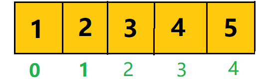

此时想要往里添加元素 '6' 但数组的容量已满

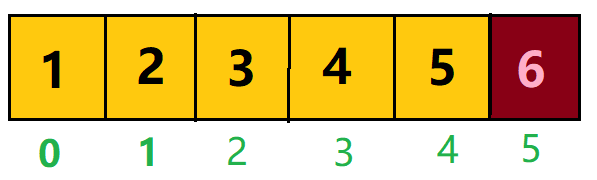

此时就要调用扩容方法grow，将容量扩大为原来的1.5倍（后改为2倍）

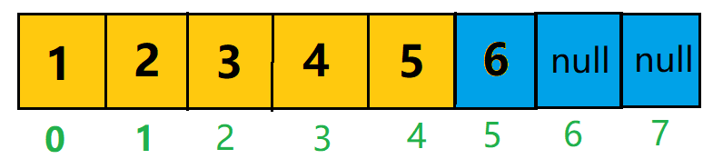

##### 缩容

与add方法不同，在remove元素以后，数组会从移除元素的座标处开始将元素前移，而末尾空出的元素则指向null。但是本质上数组的容量是不变的，即占用的内存是不变的，这样会大大浪费内存空间。

继续依照上图中的数组，在扩容后容量为7的数组中，移除元素 '4' 下标为3

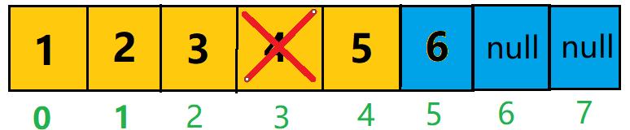

最终得到如下

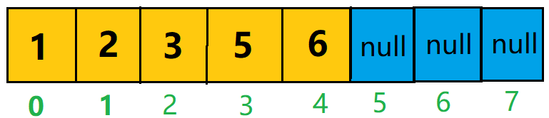

由此可见，删除元素后容量并没有改变。数组容量减半，运行机制如下

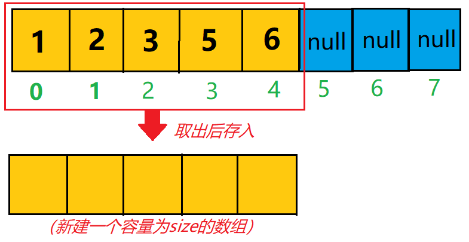

## 静态代理

### 学习路程

查阅CSDN中的文章理解学习

定义：由程序员创建或工具生成代理类的源码，再编译代理类。

### 个人理解

在程序运行前，所需要执行的业务已经被编译并储存在特定区域等待调用即可。当用户对象需要执行该业务时，只需要通过代理对象即可获得想要的业务结果，其过程由代理进行处理。

### 逻辑图

下面是根据考核题目作答草拟的逻辑图

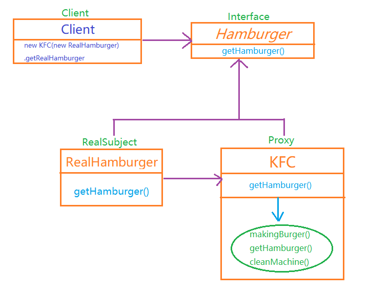

## 装饰模式

定义：装饰模式是在不必改变原类文件和使用继承的情况下，动态地扩展一个对象的功能。它是通过创建一个包装对象，也就是装饰来包裹真实的对象。

### 个人理解

装饰模式就是对原有产品进行包装亦或是升级，在原有基础上更新迭代更多的新功能。

### 逻辑图

下面是根据考核题目作答草拟的逻辑图

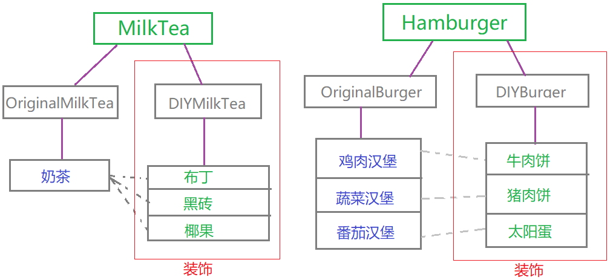

## 抽象工厂

### 个人理解

抽象工厂是将产品的各个细节生产步骤放置在工厂内，Client获取产品时能够一步到位获取整个产品。

### 逻辑图

下面是根据考核题目作答草拟的逻辑图

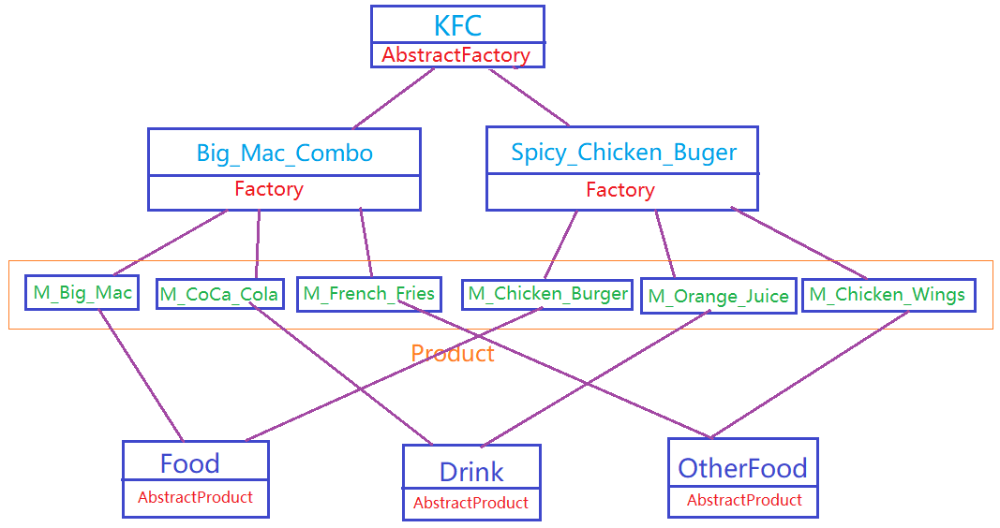

## 简单数据库设计

### 建表

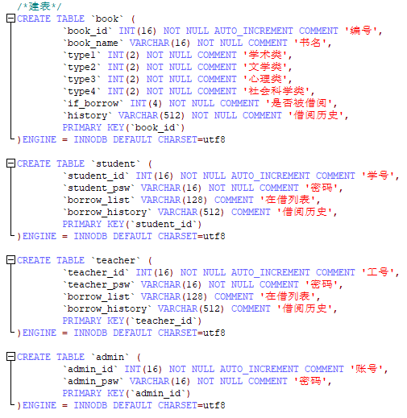

### 插入数据

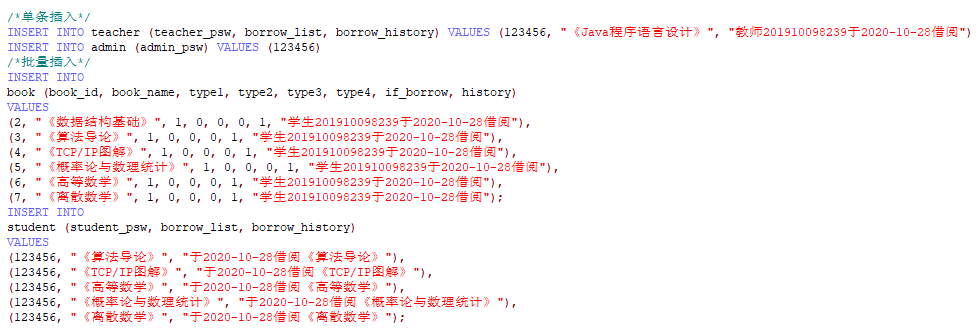

### 查询数据

查询表

查询表中某字段的数据

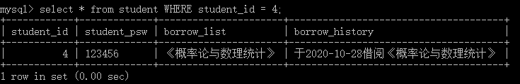

### 删除数据

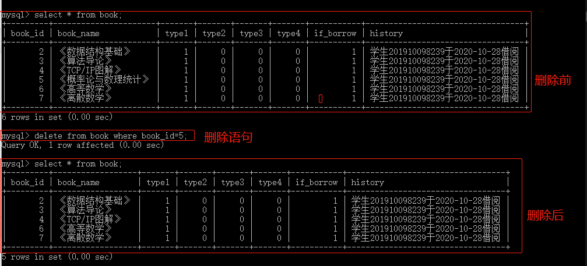